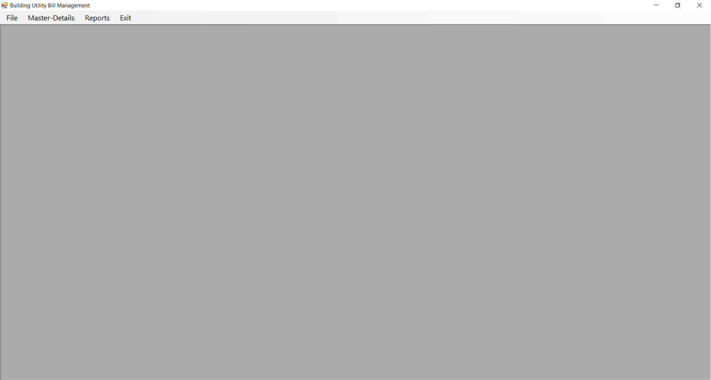
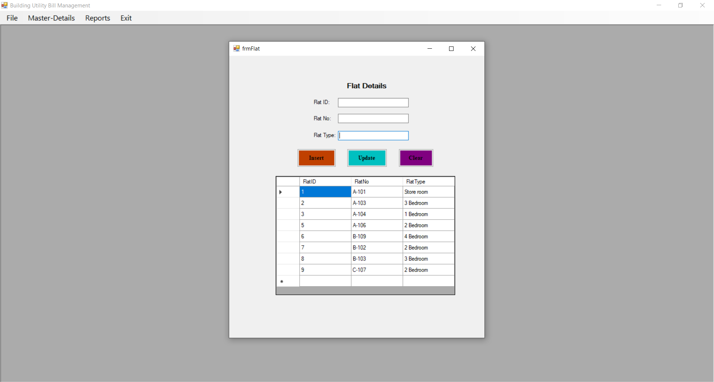
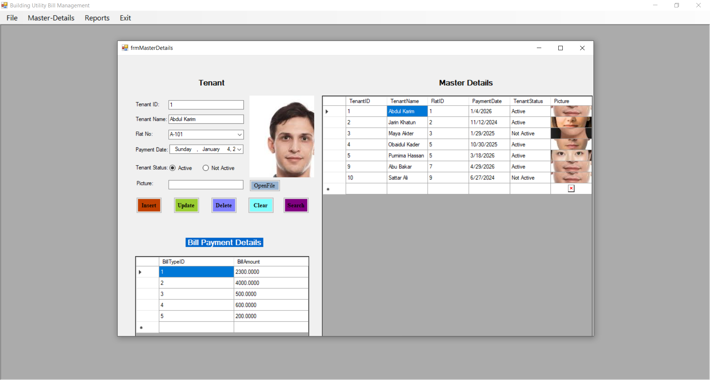
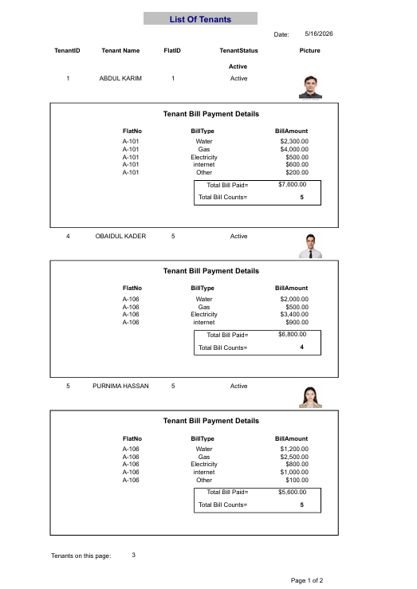
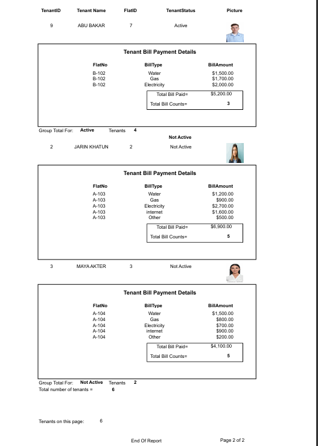
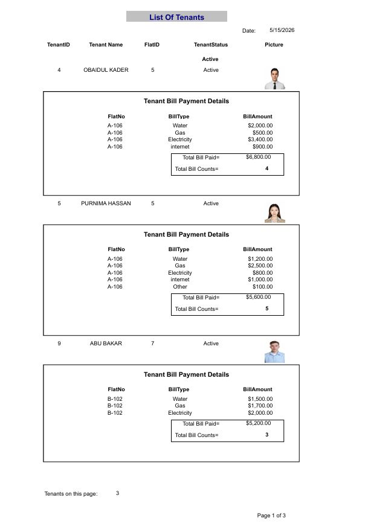
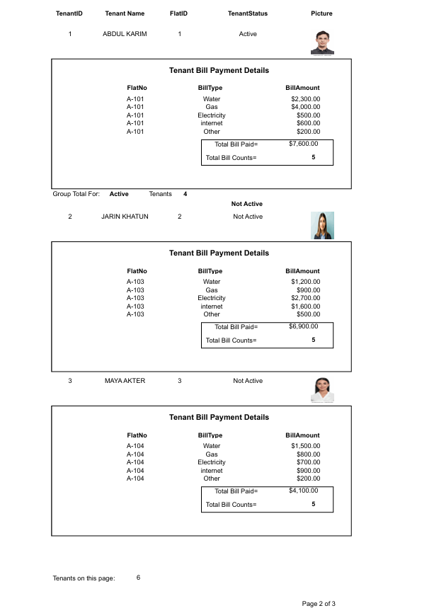
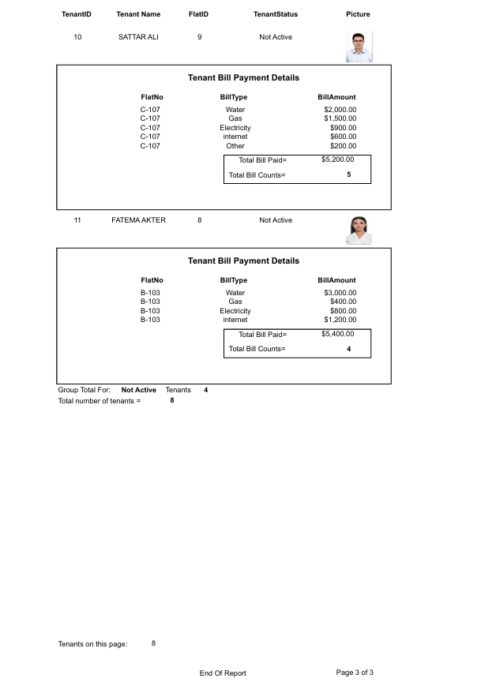

# Utility Bill Management System

A C# Windows Forms desktop application for managing the tenants of a building and the utility bills they pay (water, gas, electricity, internet and other). Data is stored in Microsoft SQL Server and printable reports are built with SAP Crystal Reports.

## Features

- **Flat management** – add, update and list flats (flat number and type).
- **Tenant master-details** – each tenant (master) is linked to a flat and holds many bill payments (details).
- **Tenant picture upload** – store a photo for each tenant in the database.
- **Bill payments** – record the amount paid for each bill type: Water, Gas, Electricity, Internet, Other.
- **Insert / Update / Delete / Search** tenants and their bills.
- **Crystal Reports**
  - *Tenant Bills Report* – bill details for one tenant.
  - *All Tenants Report* – every tenant grouped by **Active / Not Active**, with picture, bill list, total bill paid, bill count and group totals.

## Tech Stack

- C# / .NET Framework 4.8 (Windows Forms)
- ADO.NET
- Microsoft SQL Server
- SAP Crystal Reports

## Database

The script is in [`SQLQuery1.sql`](SQLQuery1.sql). It creates the `BuildingDB` database with these tables:

| Table | Purpose |
|---|---|
| `Flat` | Flat number and type |
| `BillType` | Lookup: Water, Gas, Electricity, internet, Other |
| `Tenant` | Master table: name, flat, payment date, status, picture |
| `BillPayment` | Details table: bill type, amount, tenant |

```
Flat 1 ──< Tenant 1 ──< BillPayment >── 1 BillType
```

## Screenshots

### Main Window



### Flat Entry



### Tenant Master-Details



### All Tenants Report (grouped by status)

| Page 1 | Page 2 |
|---|---|
|  |  |

### Tenant Bills Report

| Page 1 | Page 2 | Page 3 |
|---|---|---|
|  |  |  |

Full PDF versions: [All Tenants Report](docs/AllTenantsBillReport.pdf) · [Tenant Bills Report](docs/TenantsBillReport.pdf)

## Getting Started

### Requirements

- Windows with Visual Studio 2019 or later
- .NET Framework 4.8
- SQL Server (Express, Developer or LocalDB)
- SAP Crystal Reports runtime for Visual Studio

### Setup

1. Clone the repository.
2. Open `SQLQuery1.sql` in SQL Server Management Studio and run it to create `BuildingDB`.
3. In `App.config`, change `Data Source=BTTH` to your own SQL Server instance name, for example `.\SQLEXPRESS` or `(localdb)\MSSQLLocalDB`.
4. Open `UtilityBillManagement.sln` in Visual Studio, restore/build, and press **F5**.

## Project Structure

```
UtilityBillManagement/
├── Form1.cs                 # Main window with menu (Flat, Master-Details, Reports, Exit)
├── frmFlat.cs               # Flat entry / update
├── frmMasterDetails.cs      # Tenant + bill payment management
├── frmAllTenantsReport.cs   # Report viewer
├── rptAllTenants.rpt        # Crystal Report: all tenants
├── rptTenantBills.rpt       # Crystal Report: tenant bills
└── App.config               # Connection string
SQLQuery1.sql                # Database script
docs/                        # Report screenshots and PDFs
```

## Author

**Fatema Akter Sherity** – [GitHub](https://github.com/fatemaaktersherity)
